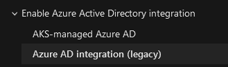
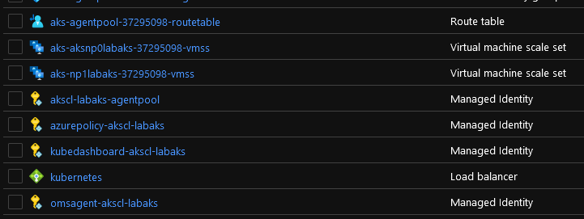
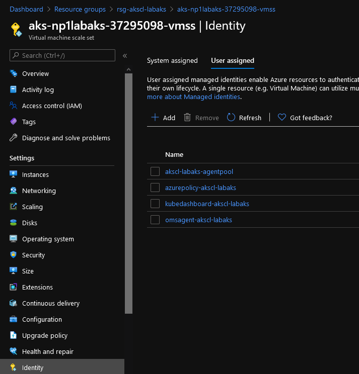
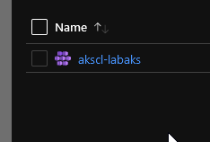
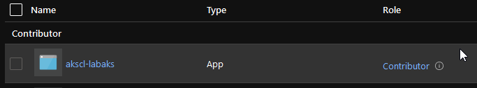

# AKS: integration to AAD with managed identity  

## Table of content  

1. Introduction
2. The old way
3. The new way
4. Impact on a terraform config stand point
5. A look on the outputs
6. Conclusion and next steps

## 1. Introduction

This (short) article aims to discuss about the evolution of AKS in terms of its integration with Azure AD.
We'll have a look at the change implied for an AKS deployment, what it changes in a terraform config and a few other useful things.

## 2. The old way

In the old times, when we used to deploy an AKS cluster, we had to rely on a  dedicated application registration to attached to the AKS cluster. This service principal would then interact directly on the Azure subscription once granted a proper RBAC role and be able to create the Azure related objects, such as load balancer, nodes or storage object for pv and pvc related actions.  

To integrate AKS with Azure AD, we had to rely on Azure AD Application registrations:

- A "Server" application registration with access on the Azure AD API to check users in AAD and grant them access accordingly through K8S binding.
- A "Client" application registration with access on the Server app only and on which the users were authenticating and then accessing AKS.

It was working fine and allowed us to secure access to RBAC enabled AKS, even if we were not able to filter access to the control plane on a Network stand point.  

However, complexity appeared when considering the maintenance of Application registration.  
  
Indeed, we had to create 3 application registrations to take care in terms of Security lifecycle, with 2 with a secret to manage.
Best practice is to rotate the secrets of those app registration on a regular basis.  

So in time, SecOps teams would have to plan the secrets rotation of those. That was documented and possible either through [az cli operation](https://docs.microsoft.com/en-us/cli/azure/aks?view=azure-cli-latest#az_aks_update_credentials) or through a little less user friendly experience through the [Azure API](https://docs.microsoft.com/en-us/rest/api/aks/managedclusters/resetaadprofile).  

Below is an example taken from the Azure Doc with az cli for the AAZD part:

```bash

az aks update-credentials -g MyResourceGroup \
                        -n MyManagedCluster \
                        --reset-aad \
                        --aad-server-app-id MyExistingAADServerAppID \
                        --aad-server-app-secret MyNewAADServerAppSecret \
                        --aad-client-app-id MyExistingAADClientAppID \
                        --aad-tenant-id MyAADTenantID

```

Unfortunately, there was no equivalent in PowerShell, which meant, at least for me, that i would not be able to rely on Azure Automation for this rotation. Thus the reason to look at the API, which could potentially be integrated in a workflow involving an event grid and an Azure function. That being said, it is no more necessary and we will now see why.

## 3. The new way

If you had the opportunity to check on the Azure documentation, you know that the previous way of integrating with Azure AD is called **Azure AD integration (legacy)** while the new one is called **AKS-managed Azure AD**



Behind this fancy name is hiding a more integrated AKS which relies on Azure managed identities.  

Yes, **plural to identities**  

From a deployment perspective, one simply specifies appropriate switches in az cli and it's done:

```bash

az aks create -g myResourceGroup \
            -n myManagedCluster \
            --enable-aad \
            --aad-admin-group-object-ids

```

Note that it asks for an Azure AD group which will be granted Cluster-Admin role in Kubernetes control plane.

Ok that look quite good. Now if you read my (quite old now) article on [Securing AKS through a terraform deployment](https://github.com/dfrappart/articles/blob/master/Secure%20AKS%20at%20Deployment.md), you'll remember that, being a terraform addict, I looked upon how to articulate this deployment through a terraform configuration.

## 4. Impact on a terraform config stand point

Just focusing on the AAD related object, in terraform, we had something similar to these in an AKS configuration:

Declaring a service principal for AKS:

```terraform

  service_principal {
    client_id         = var.K8SSPId
    client_secret     = var.K8SSPSecret

  }

```

Declaring the Azure AD integration

```terraform

  role_based_access_control {
    enabled               = true

    azure_active_directory {
      client_app_id       = var.AADCliAppId
      server_app_id       = var.AADServerAppId
      server_app_secret   = var.AADServerAppSecret
      tenant_id           = var.AADTenantId
    }

  }

```

In the **azure_active_directory** block, we had to specify the client and server application registration parameters. Take note on this topic, that the server app secret was thus visible in the terraform state. It is usually secured but still, best to understand that and also to plan for secret rotation.

Now, since we don't use anymore the *legacy* way, we change from this blocks to the simplified versions below:

```terraform

  #Moving from sp to managed id
  #service_principal {
  #  client_id                             = var.K8SSPId
  #  client_secret                         = var.K8SSPSecret
  #}
  identity {
    type                                  = "SystemAssigned"
  }

```

```terraform

  role_based_access_control {
    enabled                               = true

    azure_active_directory {
      managed                             = true
      admin_group_object_ids              = var.AKSClusterAdminsIds

      #Moving to Managed AAD Cluster, those information are unecessary
      #client_app_id                      = var.AADCliAppId
      #server_app_id                      = var.AADServerAppId
      #server_app_secret                  = var.AADServerAppSecret
      #tenant_id                          = var.AADTenantId
    }

  }

```

So instead of the **service_principal** block, we have an identity block and instead of the **azure_active_directory** with the client and server app parameters, we only specify the managed and admin_group_object_ids parameters.  

Ok, last but not least, we want to see what is created by this deployment, related to the identities.

## 5. Output of all parameters of AKS

Let's add the following in the outputs:

```terraform

output "AKSFullOutput" {
  value                                     = azurerm_kubernetes_cluster.TerraAKSwithRBAC
}

```

As seen, we are only adding the name of the resource, in this case it is **TerraAKSwithRBAC**
It will look like that then as an output (with additional information that are removed here for security reasons ^^):

```json

{
  "addon_profile" = [
    {
      "aci_connector_linux" = []
      "azure_policy" = [        
        {
          "enabled" = true      
        },
      ]
      "http_application_routing" = [
        {
          "enabled" = false
          "http_application_routing_zone_name" = ""
        },
      ]
      "kube_dashboard" = [
        {
          "enabled" = true
        },
      ]
      "oms_agent" = [
        {
          "enabled" = true
          "log_analytics_workspace_id" = ""
          "oms_agent_identity" = [
            {
              "client_id" = ""
              "object_id" = ""
              "user_assigned_identity_id" = ""
            },
          ]
        },
      ]
    },
  ]
  "auto_scaler_profile" = [
    {
      "balance_similar_node_groups" = false
      "max_graceful_termination_sec" = "600"
      "scale_down_delay_after_add" = "10m"
      "scale_down_delay_after_delete" = "10s"
      "scale_down_delay_after_failure" = "3m"
      "scale_down_unneeded" = "10m"
      "scale_down_unready" = "20m"
      "scale_down_utilization_threshold" = "0.5"
      "scan_interval" = "10s"
    },
  ]
  "default_node_pool" = [
    {
      "availability_zones" = [
        "1",
        "2",
        "3",
      ]
      "enable_auto_scaling" = true
      "enable_node_public_ip" = false
      "max_count" = 10
      "max_pods" = 100
      "min_count" = 2
      "name" = "aksnp0labaks"
      "node_count" = 3
      "orchestrator_version" = "1.18.10"
      "os_disk_size_gb" = 30
      "os_disk_type" = "Managed"
      "proximity_placement_group_id" = ""
      "tags" = {
        "AKSNodePool" = "aksnp0labaks"
        "Environment" = "lab"
        "ManagedBy" = "Terraform"
        "ResourceOwner" = "CloudTeam"
      }
      "type" = "VirtualMachineScaleSets"
      "vm_size" = "Standard_DS2_v2"
      "vnet_subnet_id" = ""
    },
  ]
  "disk_encryption_set_id" = ""
  "dns_prefix" = "akscl-labaks"
  "enable_pod_security_policy" = false
  "fqdn" = ""
  "id" = ""
  "identity" = [
    {
      "principal_id" = ""
      "tenant_id" = ""
      "type" = "SystemAssigned"
    },
  ]
  "kube_admin_config" = [
    {
      "client_certificate" = ""
      "client_key" = ""
      "cluster_ca_certificate" = ""
      "host" = ""
      "password" = ""
      "username" = ""
    },
  ]
  "kube_admin_config_raw" = ""
  "kube_config" = [
    {
      "client_certificate" = ""
      "client_key" = ""
      "cluster_ca_certificate" = ""
      "host" = ""
      "password" = ""
      "username" = ""
    },
  ]
  "kube_config_raw" = ""
  "kubelet_identity" = [
    {
      "client_id" = ""
      "object_id" = ""
      "user_assigned_identity_id" = ""
    },
  ]
  "kubernetes_version" = "1.18.10"
  "linux_profile" = [
    {
      "admin_username" = ""
      "ssh_key" = [
        {
          "key_data" = ""
        },
      ]
    },
  ]
  "location" = "westeurope"
  "name" = "akscl-labaks"
  "network_profile" = [
    {
      "dns_service_ip" = "10.0.0.10"
      "docker_bridge_cidr" = "172.17.0.1/16"
      "load_balancer_profile" = [
        {
          "effective_outbound_ips" = [
            "",
          ]
          "idle_timeout_in_minutes" = 0
          "managed_outbound_ip_count" = 1
          "outbound_ip_address_ids" = []
          "outbound_ip_prefix_ids" = []
          "outbound_ports_allocated" = 0
        },
      ]
      "load_balancer_sku" = "Standard"
      "network_plugin" = "kubenet"
      "network_policy" = "calico"
      "outbound_type" = "loadBalancer"
      "pod_cidr" = "10.244.0.0/16"
      "service_cidr" = "10.0.0.0/16"
    },
  ]
  "node_resource_group" = "rsg-akscl-labaks"
  "private_cluster_enabled" = false
  "private_fqdn" = ""
  "private_link_enabled" = false
  "resource_group_name" = "rsg-dffr-lab-aks-aks"
  "role_based_access_control" = [
    {
      "azure_active_directory" = [
        {
          "admin_group_object_ids" = [
            "",
          ]
          "client_app_id" = ""
          "managed" = true
          "server_app_id" = ""
          "server_app_secret" = ""
          "tenant_id" = ""
        },
      ]
      "enabled" = true
    },
  ]
  "service_principal" = []
  "sku_tier" = "Free"
  "tags" = {
    "Environment" = "lab"
    "ManagedBy" = "Terraform"
    "ResourceOwner" = "CloudTeam"
  }
  "windows_profile" = []
}

```

In a more human readable format, it show something like that on the portal:  



We can see a bunch of identity objects that are attached to the node pools:  



notably, the identity for the agent pool is the one corresponding to the kubelet_identity that is displayed in the terraform outputs.

```json

  "kubelet_identity" = [
    {
      "client_id" = ""
      "object_id" = ""
      "user_assigned_identity_id" = ""
    },

```

This one is important, we will see why in another article :)  
One that we cannot see directly through the portal is the system Assigned Identity on the AKS objectitself. It is however visible here in the terraform output:

```json

  "identity" = [
    {
      "principal_id" = ""
      "tenant_id" = ""
      "type" = "SystemAssigned"
    },
  ]

```

It is clearly identified as a SystemAssigned type, and if we needed more, we can see that the service_principal is really empty:

```json

  "service_principal" = []

```

and find the System Assigned Identity on the portal by looking in the IAM section:





## 6. Conclusion and next steps

Ok, we're at the end for today.  
We've seen how AKS-Managed Azure AD is created and how it simplify a few steps in the deployment. Note also that we don't need to add the managed identity in any RBAC assignment as it is managed automatically, at least on the node resource group. We will discuss potential additional assignment in another article :p  

We can also avoid maintenance action on the cluster related to the old Application registrations. that's 2 less actions to think about.  

Well, that's about all for this one. I hope you did learn some stuff in it ^^
See you soon!
