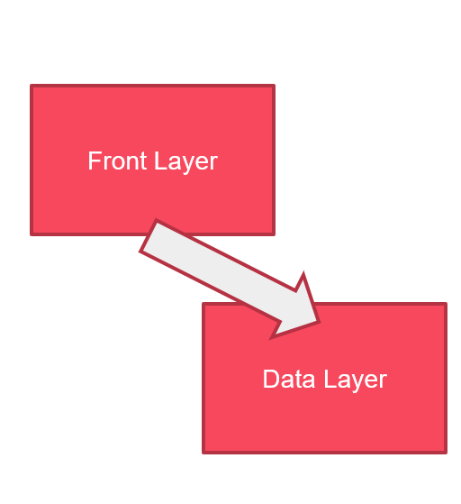
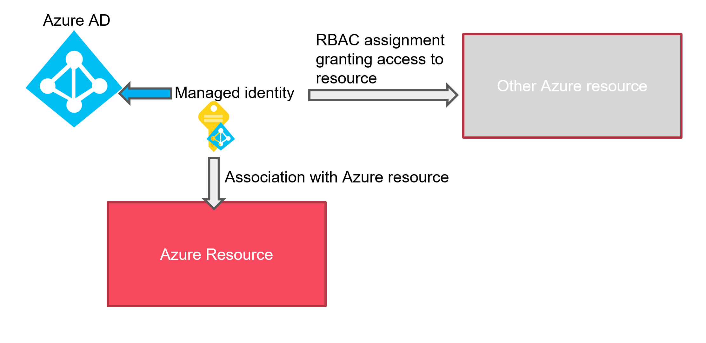
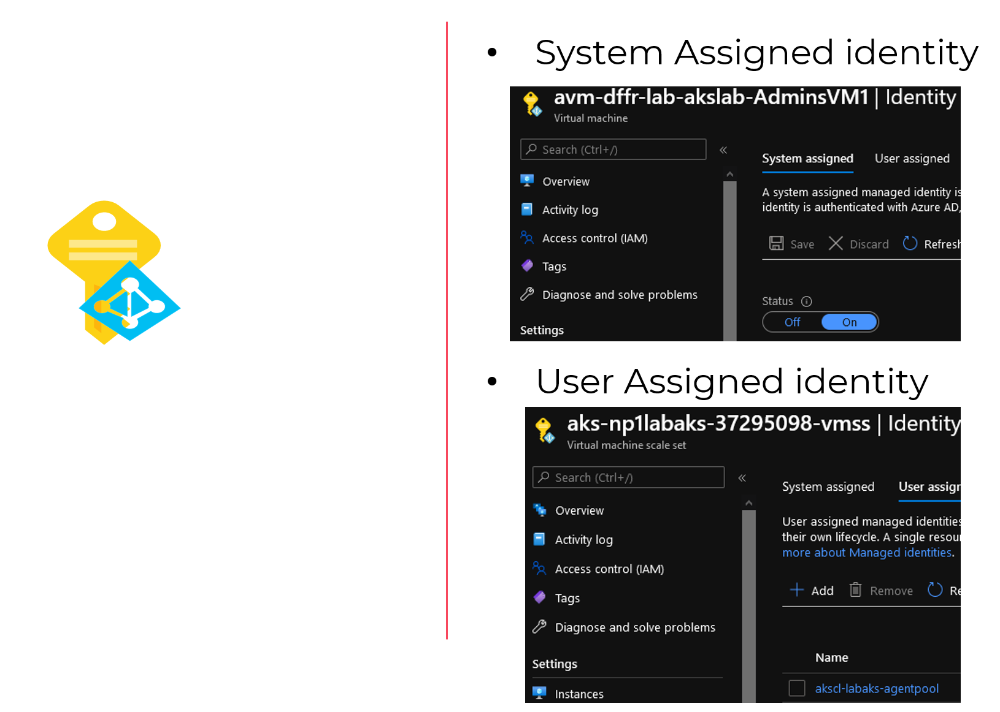
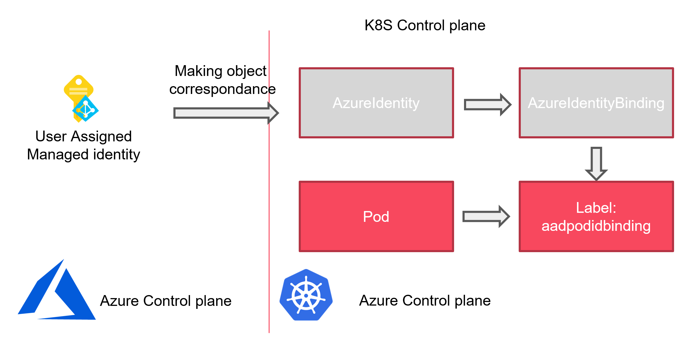
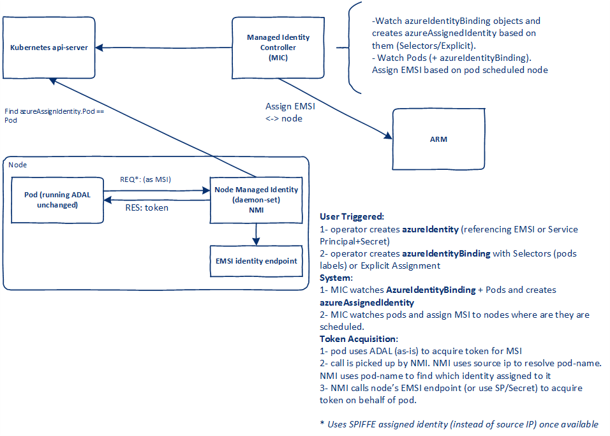
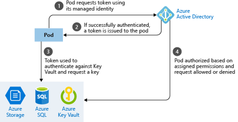
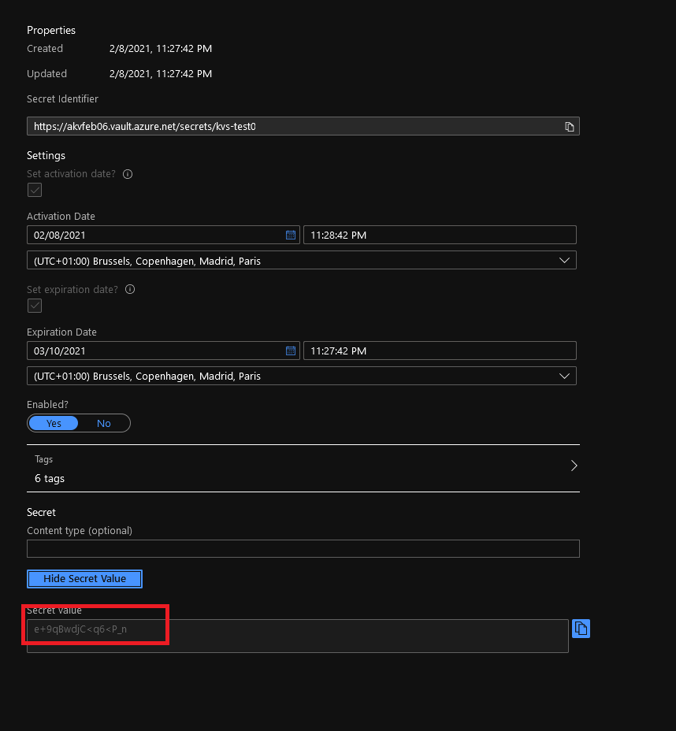

# AKS: Use AAD identity for pods and make your SecOps happy  

## Table of content  

1. Introduction
2. Review of the need
3. Basic concepts of Managed Identity in Azure
4. Where containers may not help
5. About Pod identity for AKS
6. Preparing installation on an AKS cluster
7. Deploying pod identity infrastructure
8. Pod Identity in action
9. Conclusion and next steps

## 1. Introduction  

In this article, we will look at Pod Identity for Azure Kubernetes Service. There are already quite a few publication on this and the github repo and web site give a good way to start.
On the other hand, there are some prerequisite to make it works and this article is somehow my own walktrhough the deployment of this feature in AKS. Hope this will be helpful for others ^^

## 2. Review of the need  

Before diving in the topic, let's put some context in place with a use case.  
We have an application, living on a server which need to access, let's say a database.  
Usualy, we will have a connection string which should rely on a service principal to access the database system. Here comes the trouble.  
This service principal need to be declared in the server, with its secret or password.
There are thus 2 important things here:

- Is the password stored securely?
- How do we rotate the password value?



Without going yet into the details, we will have exactly the same issue in containerized environment, and even more but we will deep in that afterward.  
For now, let's just say that Cloud platforms such as Azure come with proposal to solve this challenge and, in Azure case, are called the managed identities.

## 3. Basic concepts of Managed Identity in Azure  

So now we have the hypothesis that the workload described entirely lives in Azure. We also take the hypothesis that the application, living on Azure VM, is supposed to reach an Azure PaaS Database system.
As everyone knows, IAM in Azure relies on Azure AD. When we need to access a resource, we will configure RBAC with existing service principals in Azure AD, those service principals being a User, a Group or a programmatic access called an Application registration. Apart for the group, all of those principals needs a secret to match when authenticating.  
So migrating in the Cloud does not seems to change the story so far.  

And here comes the managed identity concept.  
A managed identity is, as the name implies, an identity managed on the Azure side. Which means that we don't care anymore about the management of this identity. Azure managed for us the password rotation, we can focus on the RBAC binding and that's all.
So in our case, the application living on the Azure VM will have a managed identity attached to the VM which in turns will be granted an RBAC assignment to be able to access the azure Database system.  
Nice !  
For information, Azure managed identity come in two flavors:

- System assigned identity (SAI), whichis an identitydirectly associated with Azure services such as VMs or functions to list a few.
- User assigned identity (UAI), whic is an identity created beforehand in Azure, and then associated to a compatible service.

**Note that only one SAI can be associated ot a service while we can have more than one UAI associated with a service instance.**  





Now let's look at that from a containerized stand point.  

## 4. Where containers may not help

Ok let's start with a disclaimer first.  
I know that containers help a great deal in application lifecycle.  
But, technically speaking, the property of a container is to isolate the runtime, providing a kind of blackbox for the rest of the system.
Which is nice in many aspect, for instance decorrelating application from dependency on the OS.  


However in our case, by isolating  the application part from the rest of the Azure platform, we lock down the managed identity capability.  
**By no mean can a container be used with managed identity...**  
Currently, that's not exactly true. For instance you can leverage managed identity for Azure Container Instance. 
However, you cannot, container natively speaking, have a container be seen directly by the Azure control plane, and thus be associated with stuff from this control plane such as the managed identity that we are talking about.

That being said, we are now in the heart of our topic. sorry for the long introduction ^^

We can assume that currently, complex containerized applications will target AKS as a hosting solution in Azure. So we will have container in pods and thus suffer this lack of flexibility to access exteral services such as the Azure PaaS portfolio.
Fortunately, smart people though about what i tried to explained here and came with a solution called pod identity.  

## 5. About Pod identity for AKS

First let's be clear.  
Initially, Pod identity was an Open Source project without official support from Microsoft (in SLA aspect i mean). It is now available in preview as an add-on (meaning support coming from Microsoft at one time)

As an OSS, it's living on [Github](https://github.com/Azure/aad-pod-identity), obviously ^^, and you can find explanations on the associated concepts on the corresponding [site](https://azure.github.io/aad-pod-identity/docs/concepts/).
Without pretending to rewrite the documentation, let's explain some concepts.
The objective is to attach a managed identity to pods and use those managed identities to gain access to Azure resources external to the cluster.
Since a pod is not by design an Azure resource, UAI will be the perfect candidate for this.  
Now the trouble here is to make a correspondance between the Azure control plane (which is Azure Active Directory), and the Kubernetes control plane.  
For that Azure pod identity relies on the following objects: (yes taken from the documentation page too :p)

- AzureIdentity which is in our case the UAI living in Azure declared in Kubernetes control plane
- AzureIdentityBinding which is the object inKubernetes API to bind a pod to an AzureIdentity (and thus an SAI) by the means of labels. We will see that in details afterward
- AzureAssignedIdentity which is an object in Kubernetes describing therelationship state between the two previous object

And that's all for the basics objects. With that we start to get an idea on how to make those things work. The following schema aims to illustrate the link between our 2 differents control plane: 



Those 3 specifics objects are the CRDs of the pod identity architecture. Now let's have a look at the core componants.  

The pod identity will operate as described on this schema, originating [Pod Identity Site](https://azure.github.io/aad-pod-identity/docs/concepts/block-diagram-and-design/)



As displayed on the picture, there are 2 kubernetes objects for the infrastructure: 

- a deployment called the MIC (Managed Identity Controller) which deploys pods responsible to watch pods and assign Managed Identities
- a daemon set called NMI (Node Managed Identity), which talk to the MIC through the API server when a Pod requires a token through a Managed Identity

Abstracting the Kubernetes Control plane, it looks like this:  




## 6. Preparing installation on an AKS cluster

After describing the concepts, it's ow time for some practial matter.
First thing ifrst we will start from an already deployed AKS cluster with the following: 

- Managed Azure AD integration (vs the legacy with app registrations)
- RBAC enabled (obviously)

I personnally deploy everything through terraform. An exemple of the config can be found [here](https://github.com/dfrappart/Terra-AZModuletest/tree/master/Custom_Modules/IaaS_AKS_ClusterwithRBAC_Kubenet).
Through terraform output proper declaration, it's quite easy to get information on the cluster for the required post configuration. 

In Pod identity documentation, it is specified that some RBAC configurations are required. I recommand reading it throroughly to avoid the discovery through trial and error (but who would do that ^^).
The roles to assign are:

- Managed Identity Operator
- Virtual Machine Contributor

Now the question is, who get those role assignments. That where we can leverage our output from terraform. I specified those outputs:

| Output name | Value | Description |
|:------------|:------------|:------|
| KubeControlPlane_SAI | `azurerm_kubernetes_cluster.TerraAKSwithRBAC.identity` | AKS Control plane Managed Identity block| 
| KubeControlPlane_SAI_PrincipalId | `azurerm_kubernetes_cluster.TerraAKSwithRBAC.identity[0].principal_id` |AKS Control plane Managed Identity principal Id | 
| KubeKubelet_UAI | `azurerm_kubernetes_cluster.TerraAKSwithRBAC.kubelet_identity` | User Assigned Identity block for the Kubelet | 
| KubeKubelet_UAI_ClientId | `azurerm_kubernetes_cluster.TerraAKSwithRBAC.kubelet_identity[0].client_id` |User Assigned Identity for kubelet principal Id |  
| KubeKubelet_UAI_ObjectId | `azurerm_kubernetes_cluster.TerraAKSwithRBAC.kubelet_identity[0].object_id` | User Assigned Identity for kubelet object Id |
| KubeKubelet_UAI_Id | `azurerm_kubernetes_cluster.TerraAKSwithRBAC.kubelet_identity[0].user_assigned_identity_id` | User Assigned Identity for kubelet resource Id | 

after deployment, the outputs gives the appropriate informations required:

```powershell

PS C:\Users\user1\Documents\IaC\Azure\Terra-AZModuletest\Tests\RG> terraform output KubeKubelet_UAI
tolist([
  {
    "client_id" = "xxxxxxxx-xxxx-xxxx-xxxx-xxxxxxxxxxxx"
    "object_id" = "xxxxxxxx-xxxx-xxxx-xxxx-xxxxxxxxxxxx"
    "user_assigned_identity_id" = "/subscriptions/xxxxxxxx-xxxx-xxxx-xxxx-xxxxxxxxxxxx/resourceGroups/rsg-dfitcfr-dev-aks-aksobjects/providers/Microsoft.ManagedIdentity/userAssignedIdentities/aks-terraaksclus-agentpool"
  },
])
PS C:\Users\davidfrappart\Documents\IaC\Azure\Terra-AZModuletest\Tests\RG> terraform output KubeControlPlane_SAI
tolist([
  {
    "principal_id" = "xxxxxxxx-xxxx-xxxx-xxxx-xxxxxxxxxxxx"
    "tenant_id" = "xxxxxxxx-xxxx-xxxx-xxxx-xxxxxxxxxxxx"
    "type" = "SystemAssigned"
    "user_assigned_identity_id" = ""
  },
])

```

With that we need to assign the roles, which can be done through a simple role assignment through terraform, like this: 

```bash

resource "azurerm_role_assignment" "TerraAssignedBuiltin" {
  scope                               = var.RBACScope
  role_definition_name                = var.BuiltinRoleName
  principal_id                        = var.ObjectId
}

```

The module i use is available [here](https://github.com/dfrappart/Terra-AZModuletest/tree/master/Modules_building_blocks/401_RBACAssignment_BuiltinRole).  

In our case, the module call should look like this: 

```bash

######################################################################
# Mapping AKS SAI to subscription - Managed Identity Operator

module "AssignAKS_SAI_ManagedIdentityOps_To_Sub" {

  #Module Location
  source                                  = "../../Modules/401_RBACAssignment_BuiltinRole/"

  #Module variable
  RBACScope                               = data.azurerm_subscription.current.id
  BuiltinRoleName                         = "Managed Identity Operator"
  ObjectId                                = module.AKS1.KubeControlPlane_SAI_PrincipalId

}

######################################################################
# Mapping AKS SAI to VM Operator role

module "AssignAKS_SAI_VMContributor_To_Sub" {

  #Module Location
  source                                  = "../../Modules/401_RBACAssignment_BuiltinRole/"

  #Module variable
  RBACScope                               = data.azurerm_subscription.current.id
  BuiltinRoleName                         = "Virtual Machine Contributor"
  ObjectId                                = module.AKS1.KubeControlPlane_SAI_PrincipalId

}

######################################################################
# Mapping AKS Kubelet UAI to subscription - Managed Identity Operator

module "AssignAKS_KubeletUAI_ManagedIdentityOps_To_Sub" {

  #Module Location
  source                                  = "../../Modules/401_RBACAssignment_BuiltinRole/"

  #Module variable
  RBACScope                               = data.azurerm_subscription.current.id
  BuiltinRoleName                         = "Managed Identity Operator"
  ObjectId                                = module.AKS1.AKSFullOutput.kubelet_identity[0].object_id
  #module.AKS1.KubeControlPlane_SAI_PrincipalId

}

######################################################################
# Mapping AKS Kubelet UAI to VM Operator role

module "AssignAKS_KubeletUAI_VMContributor_To_Sub" {

  #Module Location
  source                                  = "../../Modules/401_RBACAssignment_BuiltinRole/"

  #Module variable
  RBACScope                               = data.azurerm_subscription.current.id
  BuiltinRoleName                         = "Virtual Machine Contributor"
  ObjectId                                = module.AKS1.AKSFullOutput.kubelet_identity[0].object_id
  #module.AKS1.KubeControlPlane_SAI_PrincipalId

}

```

That's it for the preparation. Next comes the installation.  

## 7. Deploying pod identity infrastructure  

To install the Pod Identity on an AKS Cluster, we refer once again to the [documentation](https://azure.github.io/aad-pod-identity/docs/getting-started/installation/).
The funny thing at first, is that the installation is by default blocked for cluster with kubenet. The reason behind is a limitation on the network security native to kubenet, but that's a story for another day.
Fortunately, there is a way to install nevertheless, by adding a switch on the nmi containers: 

```yaml

      containers:
      - name: nmi
        image: "mcr.microsoft.com/oss/azure/aad-pod-identity/nmi:v1.7.3"
        imagePullPolicy: Always
        args:
          - "--node=$(NODE_NAME)"
          - "--http-probe-port=8085"
          - "--allow-network-plugin-kubenet=true"

```

Once the yaml file is modified accordingly, it is time to deploy the pod identity infra and the associated exception: 

```powershell

PS C:\Users\AKSPodIdMeetup\02_PodIdentity_Yaml> kubectl apply -f podidentityforkubenet.yaml
serviceaccount/aad-pod-id-nmi-service-account created
customresourcedefinition.apiextensions.k8s.io/azureassignedidentities.aadpodidentity.k8s.io created
customresourcedefinition.apiextensions.k8s.io/azureidentitybindings.aadpodidentity.k8s.io created
customresourcedefinition.apiextensions.k8s.io/azureidentities.aadpodidentity.k8s.io created
customresourcedefinition.apiextensions.k8s.io/azurepodidentityexceptions.aadpodidentity.k8s.io created
clusterrole.rbac.authorization.k8s.io/aad-pod-id-nmi-role created
clusterrolebinding.rbac.authorization.k8s.io/aad-pod-id-nmi-binding created
daemonset.apps/nmi created
serviceaccount/aad-pod-id-mic-service-account created
clusterrole.rbac.authorization.k8s.io/aad-pod-id-mic-role created
clusterrolebinding.rbac.authorization.k8s.io/aad-pod-id-mic-binding created
deployment.apps/mic created
PS C:\Users\AKSPodIdMeetup\02_PodIdentity_Yaml> kubectl apply -f podidentityexception.yaml
azurepodidentityexception.aadpodidentity.k8s.io/mic-exception created
azurepodidentityexception.aadpodidentity.k8s.io/aks-addon-exception created

```

To check the installation we can simply run a kubectl get pods, since at this point, everything is still in the default namespace: 

```powershell

PS C:\Users\AKSPodIdMeetup\02_PodIdentity_Yaml> kubectl get pods
NAME                   READY   STATUS    RESTARTS   AGE
mic-7d6655bcc4-8pxx9   1/1     Running   0          2m45s
mic-7d6655bcc4-mfwkn   1/1     Running   0          2m44s
nmi-gjjx6              1/1     Running   0          2m45s
nmi-xdwxc              1/1     Running   0          2m45s

```

Check the logs after installation

```powershell

PS C:\Users\AKSPodIdMeetup\02_PodIdentity_Yaml> kubectl logs mic-7d6655bcc4-8pxx9 --since=300s
I0207 02:22:34.336491       1 main.go:114] starting mic process. Version: v1.7.3. Build date: 2021-02-05-22:16
W0207 02:22:34.337401       1 main.go:119] --kubeconfig not passed will use InClusterConfig
I0207 02:22:34.337410       1 main.go:136] kubeconfig () cloudconfig (/etc/kubernetes/azure.json)
I0207 02:22:34.337657       1 main.go:144] running MIC in namespaced mode: false
I0207 02:22:34.337673       1 main.go:148] client QPS set to: 5. Burst to: 5
I0207 02:22:34.337692       1 mic.go:139] starting to create the pod identity client. Version: v1.7.3. Build date: 2021-02-05-22:16
I0207 02:22:34.362991       1 mic.go:145] Kubernetes server version: v1.18.14
I0207 02:22:34.363295       1 cloudprovider.go:123] MIC using user assigned identity: ae95##### REDACTED #####5f1d for authentication.
I0207 02:22:34.365435       1 probes.go:41] initialized health probe on port 8080
I0207 02:22:34.365446       1 probes.go:44] started health probe
I0207 02:22:34.365512       1 metrics.go:341] registered views for metric
I0207 02:22:34.365553       1 prometheus_exporter.go:21] starting Prometheus exporter
I0207 02:22:34.365559       1 metrics.go:347] registered and exported metrics on port 8888
I0207 02:22:34.365563       1 mic.go:240] initiating MIC Leader election
I0207 02:22:34.365571       1 leaderelection.go:243] attempting to acquire leader lease  default/aad-pod-identity-mic...
I0207 02:22:34.451011       1 leaderelection.go:253] successfully acquired lease default/aad-pod-identity-mic
I0207 02:22:34.799053       1 mic.go:313] upgrading the types to work with case sensitive go-client
I0207 02:22:34.825096       1 mic.go:317] type upgrade completed !!
I0207 02:22:35.283409       1 crd.go:456] CRD informers started
I0207 02:22:35.483460       1 pod.go:72] pod cache synchronized. Took 500.130342ms
I0207 02:22:35.483489       1 pod.go:79] pod watcher started !!
I0207 02:22:35.483511       1 mic.go:398] sync thread started.

```

Now we can deploy the CRD for Azure Identity. Fior that we need to have the azureidentity manifest and the azure identity binding manifest. Since we need to have those objects corresponding to an object in Azure, i personnaly use a local file resource in terraform to build the definition from interpolation. The tempalted yaml are as follow: 

```yaml

apiVersion: "aadpodidentity.k8s.io/v1"
kind: AzureIdentity
metadata:
  name: ${UAIName}
spec:
  type: 0
  resourceID: ${UAIId}
  clientID: ${UAIClientId}

```

```yaml

apiVersion: "aadpodidentity.k8s.io/v1"
kind: AzureIdentityBinding
metadata:
  name: ${UAIName}-binding
spec:
  azureIdentity: ${UAIName}
  selector: ${UAIName}-binding

```

I use a specific module to make the yaml at the User Assigned IDentity creation. You can find this module [here](https://github.com/dfrappart/Terra-AZModuletest/tree/master/Custom_Modules/Kube_UAI)

The module output the interpolated yaml in output like this: 

```bash

output "podidentitymanifest" {
  value = templatefile("${path.module}/yaml_template/podidentity-template.yaml",
    {
      UAIName                             = azurerm_user_assigned_identity.terraUAI.name,
      UAIId                               = azurerm_user_assigned_identity.terraUAI.id,
      UAIClientId                         = azurerm_user_assigned_identity.terraUAI.client_id,
    }
  )
}

output "podidentitybindingmanifest" {
  value = templatefile("${path.module}/yaml_template/podidentitybinding-template.yaml",
    {
      UAIName                             = azurerm_user_assigned_identity.terraUAI.name,
    }
  )

}

```

and afterward, as mentioned, through a simple local file resource, the files are generated: 

```bash

resource "local_file" "podidentitymanifest" {
  content                                 = module.UAI1.podidentitymanifest
  filename                                = "../02_PodIdentity_Yaml/PodId/${module.UAI1.Name}.yaml"
}

resource "local_file" "podidentitybindingmanifest" {
  content                                 = module.UAI1.podidentitybindingmanifest
  filename                                = "../02_PodIdentity_Yaml/PodId/${module.UAI1.Name}_Binding.yaml"
}

```

Now we have everything available to use pod identity, except something to use it with. Before that, it is important to understand how a pod is linked to a managed identity. As we have described, we have 2 objects, the `AzureIdentity` and the `AzureIdentityBinding`.
The second is the glue with the pod. With the selector spec, we can add to a pod a specific label which, if it match the selector, will allow the mic to identify the link between pod and UAI: 

```yaml

  labels:
    aadpodidbinding: ${UAIName}-binding

```

Ok, that being said, we can focus on an example. 

## 8. Pod Identity in action

A simple example is to give access to a keyvault, through the CSI Driver for keyvault. Since we want to focus on the pod identity here, we will just= list some link: 

```

https://github.com/kubernetes-sigs/secrets-store-csi-driver#usage

https://docs.microsoft.com/en-us/azure/key-vault/general/key-vault-integrate-kubernetes

https://azure.github.io/secrets-store-csi-driver-provider-azure/getting-started/installation/#using-deployment-yamls

```

In this use case, a secret store pointing to a key vault is created: 

```yaml

apiVersion: secrets-store.csi.x-k8s.io/v1alpha1
kind: SecretProviderClass
metadata:
  name: ${KVName}
spec:
  provider: azure
  parameters:
    usePodIdentity: "true"               
    userAssignedIdentityID: ${UAIClientId}
    keyvaultName: ${KVName}
    cloudName: ""                               
    objects:  |
      array:
        - |
          objectName: ${SecretName}
          objectAlias: ${SecretName}            
          objectType: secret                    
          objectVersion: ${SecretVersion}       
    tenantId: ${TenantId}    

```

And then a pod, using the same secret store:

```yaml

apiVersion: v1
kind: Pod
metadata:
  name: nginx-secrets-store-inline
  labels:
    aadpodidbinding: ${UAIName}-binding
spec:
  containers:
    - name: nginx
      image: nginx
      volumeMounts:
        - name: secrets-store-inline
          mountPath: "/mnt/secrets-store"
          readOnly: true
  volumes:
    - name: secrets-store-inline
      csi:
        driver: secrets-store.csi.k8s.io
        readOnly: true
        volumeAttributes:
          secretProviderClass: ${KVName}

```

Running the following commands, we can check that the pod is able to reach the key vault and get the secret value **without using any password in the pod definition**:

```bash

PS C:\Users\aksmeetup\01_Infra> kubectl exec nginx-secrets-store-inline -- ls /mnt/secrets-store
kvs-test01

PS C:\Users\aksmeetup\01_Infra> kubectl exec nginx-secrets-store-inline -- cat /mnt/secrets-store/kvs-test01
e+9qBwdjC<q6<P_n

```

This should be the same value as the key vault secret on the portal: 



And that's it for the demo. Now a time for the conclusion.  


## 9. Conclusion and next steps

So, if i'm correct, chance are the technology seems interesting but there are still some question remaining. 
Well that's the case for me atthis point.
While the architecture and how it's working between the 2 worlds (Azure and Kubernetes) seems clear enough, the impact on how to use it does not seem as clear.
Also, as presented here, as an OSS, it is not fully supported by Microsoft.
However, we mentionned that the support is coming,with a simpler way of managing it through an Addon. This is similar to the way AGIC evolved and it should become easier in time.
On a more practical aspect, i do know that [Velero](https://velero.io/) can be installed with pod identity in mind. I would guess that the use will get more frequent and also simpler.
Voila, i hope it was as fun for you as for me.
Before i forget, i created a dedicated github repo for all the requiredinfrastructure to use this. It's [here](https://github.com/dfrappart/aksmeetup), feel free to use it.
See you soon !
